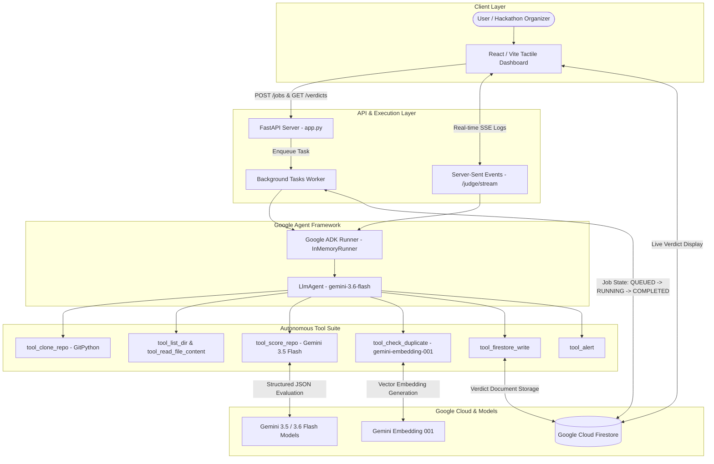

# Judging Copilot 🤖⚖️

> **Autonomous Hackathon Submission Verification & Judging Agent**  
> Built for the Google/Devpost *All Things Agentic Hackathon* (Taskmaster Track).  
> Powered by **Google ADK (Agent Development Kit)**, **Gemini 3.5/3.6**, **Google Cloud Firestore**, **FastAPI**, and **React / Vite**.

---

## 📋 Executive Summary

### The Problem
Evaluating hundreds of software repository submissions during hackathons presents significant challenges:
* **Reviewer Fatigue & Inconsistency:** Manual review across multiple judges results in subjective and variable scoring.
* **Plagiarism & Duplicate Submissions:** Identifying plagiarized or re-submitted past projects across large submission pools is labor-intensive and error-prone.
* **Evaluation Bottlenecks:** Human evaluation creates delays, stalling leaderboard updates and organizer decisions.

### The Solution
**Judging Copilot** is an autonomous judging agent that eliminates evaluation bottlenecks. When provided with a public GitHub repository URL, the agent:
1. **Clones and inspects** the codebase securely.
2. **Evaluates code quality, completeness, documentation, and technology integration** using **Gemini 3.5 Flash** with strict structured JSON schemas.
3. **Generates vector embeddings** via `gemini-embedding-001` and performs local cosine similarity comparisons against reference projects to flag plagiarism.
4. **Persists structured verdicts and asynchronous job states** to **Google Cloud Firestore**.
5. **Triggers automated organizer alerts** for low-scoring or duplicate-flagged submissions.

---

## 🏗 System Architecture

The following diagram illustrates how the frontend, FastAPI backend, Google ADK autonomous agent, Gemini models, and Google Cloud Firestore interact:



---

## 🛠 Technology Stack

| Component | Technology | Purpose |
|---|---|---|
| **Agent Framework** | **Google ADK (2.8.0)** | Multi-tool autonomous agent orchestration (`LlmAgent`, `InMemoryRunner`) |
| **Primary LLM** | **Gemini 3.6 Flash** | Autonomous agent reasoning and tool invocation decision-making |
| **Scoring LLM** | **Gemini 3.5 Flash** | Structured rubric evaluation with Pydantic JSON schema constraints |
| **Embeddings** | **gemini-embedding-001** | High-dimensional vector generation for plagiarism cosine similarity checks |
| **Database** | **Google Cloud Firestore** | Asynchronous job state storage and final verdict persistence |
| **Backend API** | **FastAPI / Uvicorn** | REST endpoints, background task management, and SSE streaming |
| **Frontend UI** | **React / Vite** | Tactile editorial dashboard with real-time live agent activity tracking |
| **Containerization** | **Docker** | Reproducible runtime environment (Python 3.11-slim + Git) |

---

## ⚡ Step-by-Step Local Setup & Execution Guide

Follow these instructions to set up and run Judging Copilot on your local machine.

### 1. Prerequisites
* **Python 3.11+** installed (`python --version`)
* **Node.js 18+ & npm** installed (`node --version`)
* **Git** installed (`git --version`)
* A **Google Gemini API Key** (from [Google AI Studio](https://aistudio.google.com/))
* A **Google Cloud / Firebase Project** with Firestore enabled

---

### 2. Installation & Configuration

#### Step 1: Clone the Repository
```bash
git clone https://github.com/owner/judging-copilot.git
cd judging-copilot
```

#### Step 2: Set Up Python Virtual Environment
```bash
python -m venv .venv

# On Linux/macOS:
source .venv/bin/activate

# On Windows (PowerShell):
\.venv\Scripts\Activate.ps1
```

#### Step 3: Install Backend Dependencies
```bash
pip install -r requirements.txt
```

#### Step 4: Configure Environment Variables
Create a `.env` file in the root directory by copying the template:
```bash
cp .env.example .env
```

Edit `.env` and fill in your configuration:
```env
# Mandatory Gemini API Key
GEMINI_API_KEY=your_gemini_api_key_here

# Mandatory path to Firebase Service Account JSON credentials
FIREBASE_CREDENTIALS_PATH=path/to/firebase-service-account.json

# Optional Latency Optimization (default: low)
GEMINI_THINKING_LEVEL=low
```

---

### 3. Running the Application

#### Step 1: Start the FastAPI Backend
```bash
python app.py
```
* Backend server starts at `http://localhost:8000`
* Interactive API documentation (Swagger UI) is available at `http://localhost:8000/docs`

#### Step 2: Start the React Frontend Dashboard
Open a new terminal window:
```bash
cd frontend
npm install
npm run dev
```
* Frontend dashboard opens at `http://localhost:5173`

---

## 🚀 Google Cloud Deployment Guide

Judging Copilot is packaged for deployment to **Google Cloud Run**.

### 1. Container Build
The project includes a production-ready `Dockerfile`:
```dockerfile
FROM python:3.11-slim
RUN apt-get update && apt-get install -y --no-install-recommends git && rm -rf /var/lib/apt/lists/*
WORKDIR /app
COPY requirements.txt .
RUN pip install --no-cache-dir -r requirements.txt
COPY app.py .
COPY storage/ ./storage/
COPY agent/ ./agent/
CMD ["python", "app.py"]
```

### 2. Build & Deploy to Google Cloud Run
Run the following Google Cloud SDK commands:

```bash
# Set your GCP Project ID
gcloud config set project YOUR_GCP_PROJECT_ID

# Build container image using Cloud Build
gcloud builds submit --tag gcr.io/YOUR_GCP_PROJECT_ID/judging-copilot:latest

# Deploy to Cloud Run using Application Default Credentials (ADC)
gcloud run deploy judging-copilot \
    --image gcr.io/YOUR_GCP_PROJECT_ID/judging-copilot:latest \
    --platform managed \
    --region us-central1 \
    --allow-unauthenticated \
    --set-env-vars GEMINI_API_KEY="your_gemini_api_key_here"
```

> **Note on Authentication:** On Google Cloud Run, `storage/firestore_client.py` automatically falls back to **Application Default Credentials (ADC)** when `FIREBASE_CREDENTIALS_PATH` is not explicitly set.

---

## 🧪 Reproducible Testing & Verification

### 1. Run Automated Unit Tests
```bash
pytest
```

### 2. Test Asynchronous Background Job API (curl)

#### Submit a Repository for Evaluation:
```bash
curl -X POST http://localhost:8000/jobs \
     -H "Content-Type: application/json" \
     -d '{"repo_url": "https://github.com/Sanchit-Darandale/GHOSTAPIS"}'
```
* **Response (HTTP 202 Accepted):**
  ```json
  {
    "job_id": "vHdn18D73aN6zlrTPB8u",
    "repo_url": "https://github.com/Sanchit-Darandale/GHOSTAPIS",
    "status": "QUEUED",
    "stage": "QUEUED",
    "created_at": "2026-08-31T17:00:42.649813+00:00",
    "updated_at": "2026-08-31T17:00:42.649813+00:00"
  }
  ```

#### Poll Job Status:
```bash
curl http://localhost:8000/jobs/vHdn18D73aN6zlrTPB8u
```

#### Fetch All Persisted Verdicts from Firestore:
```bash
curl http://localhost:8000/verdicts
```

---

## 📁 Repository Structure

```
judging-copilot/
├── app.py                      # FastAPI server routes (REST endpoints & SSE stream)
├── Dockerfile                  # Container definition (Python 3.11-slim + Git)
├── requirements.txt            # Python package requirements
├── pytest.ini                  # Pytest configuration
├── README.md                   # Project documentation & reproducibility guide
├── agent/                      # Autonomous judging logic
│   ├── orchestrator.py        # ADK LlmAgent setup, tool registration & workflow execution
│   ├── scorer.py               # Gemini 3.5 structured rubric scoring engine
│   ├── duplicate_check.py     # gemini-embedding-001 vector similarity engine
│   ├── clone_tool.py           # Git repository cloning module
│   └── prompts/
│       └── rubric_prompt.txt   # Judging rubric prompt definition
├── storage/
│   └── firestore_client.py     # Firestore driver (verdicts & jobs collections)
├── alerts/
│   └── notifier.py             # Organizer alert dispatcher
├── data/
│   └── past_submissions/       # Reference repository dataset for similarity checks
└── frontend/                   # React / Vite dashboard
    ├── src/
    │   ├── config.js           # Centralized API base URL configuration
    │   ├── App.jsx             # Main dashboard UI shell
    │   └── components/         # Real-time activity drawer & verdict drawer components
```

---

## 🔒 Security Hardening

Judging Copilot implements robust protections against malicious or untrusted repository submissions:
* **Path Traversal Protection:** `tool_read_file_content` validates that target file paths remain strictly contained within the cloned repository root using `Path.resolve().relative_to()`.
* **Symlink Traversal Protection:** Directory walkers explicitly reject symbolic links and symlinked parent directories.
* **Prompt Injection Isolation:** Untrusted repository contents are sanitized (`<` and `>` escaped) and enclosed within explicit data boundaries instructing the LLM to treat them purely as passive evidence.
* **Resource Limits:** Token prompt caps (80,000 max repo characters, 8,000 max per-file characters) prevent Denial-of-Service (DoS) context blowups.

---

## 📄 License & Hackathon Notice

Built for the **Google/Devpost All Things Agentic Hackathon** (Taskmaster Track).  
Distributed under the MIT License.
