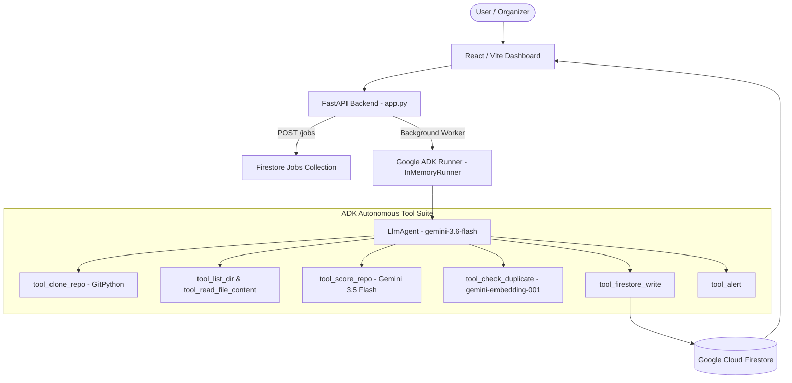

# Judging Copilot

An autonomous hackathon submission verification agent built with **Google ADK**, **Gemini 3.5/3.6**, **Firestore**, and **FastAPI**.

---

## Overview

### Problem
Hackathon organizers face a major challenge evaluating hundreds of repository submissions under strict deadlines. Manual reviews are slow, inconsistent, susceptible to fatigue, and vulnerable to plagiarized or superficial projects.

### Solution
**Judging Copilot** automates hackathon judging using an autonomous **Google ADK** agent. It ingests public GitHub repository URLs, performs deep file and code analysis, evaluates the code against strict criteria, runs vector similarity duplicate detection against previous submissions, persists structured verdicts to **Firestore**, and alerts organizers on potential issues.

---

## Architecture & Workflow



### Key Components
1. **Google ADK Agent Framework:** `LlmAgent` running `gemini-3.6-flash` dynamically selects and coordinates tool executions.
2. **Gemini Structured Scoring:** Uses `gemini-3.5-flash` with strict Pydantic JSON schemas (`GeminiScoreResponse`) to evaluate code quality, completeness, documentation, and technology integration.
3. **Vector Duplicate Detection:** Uses `gemini-embedding-001` embeddings and local cosine similarity to detect plagiarized submissions against reference data.
4. **Google Cloud Firestore:** Persists asynchronous job states (`jobs` collection) and final structured verdicts (`verdicts` collection) supporting both local service accounts and Application Default Credentials (ADC).
5. **Asynchronous Background Pipeline:** Non-blocking `POST /jobs` returns an immediate HTTP 202 `job_id`, while real-time execution progress is streamed via SSE (`GET /judge/stream`).

---

## Project Structure

```
agent/
  orchestrator.py       # ADK LlmAgent definition, tool wrappers & workflow execution
  clone_tool.py         # Step 1: Git clone helper
  scorer.py             # Step 2: Gemini 3.5 structured rubric scoring engine
  duplicate_check.py    # Step 3: gemini-embedding-001 duplicate detection engine
  prompts/
    rubric_prompt.txt   # Canonical judging rubric prompt
storage/
  firestore_client.py   # Firestore database driver (verdicts & jobs collections)
alerts/
  notifier.py           # Alert dispatcher for flagged verdicts
data/
  past_submissions/     # Reference repositories for similarity comparison
frontend/               # React / Vite tactile dashboard
app.py                  # FastAPI server & REST/SSE routes
```

---

## Setup & Running Locally

### 1. Prerequisites & Environment Setup
- Python 3.11+
- Node.js 18+ & npm

```bash
# Clone the repository
git clone https://github.com/owner/judging-copilot.git
cd judging-copilot

# Install Python dependencies
pip install -r requirements.txt

# Configure environment secrets
cp .env.example .env
```

Edit `.env` and fill in your keys:
```env
GEMINI_API_KEY=your_gemini_api_key_here
FIREBASE_CREDENTIALS_PATH=path/to/firebase_service_account.json
# Optional tuning:
GEMINI_THINKING_LEVEL=low
```

### 2. Running Backend Server
```bash
python app.py
```
The FastAPI backend will start at `http://localhost:8000`.

### 3. Running Frontend Dashboard
```bash
cd frontend
npm install
npm run dev
```
The dashboard will open at `http://localhost:5173`.

---

## Reproducible Testing Instructions

### Run Unit Tests
```bash
pytest
```

### Test Asynchronous Job API via curl
```bash
# Submit a GitHub repository for background evaluation:
curl -X POST http://localhost:8000/jobs \
     -H "Content-Type: application/json" \
     -d '{"repo_url": "https://github.com/Sanchit-Darandale/GHOSTAPIS"}'

# Poll job status (using returned job_id):
curl http://localhost:8000/jobs/<job_id>

# Retrieve stored verdicts:
curl http://localhost:8000/verdicts
```
